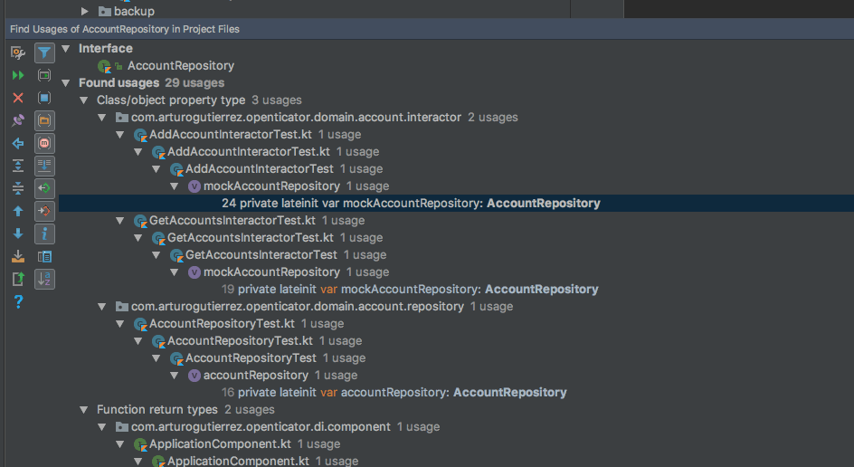

# Exclude generated code from searches or usages in Android Studio

It's very common to use a third party library with code generation in our
Android projects, for example: [Dagger 2](https://github.com/google/dagger).
Usually, you don't care about this generated code but you often find it when
you are finding usages of a method or a class that is being used in the
generated code, making too hard find the real usages in your codebase.

Android Studio (and IDEA) give us a way to filter any code that we want from
searches or usages: **Scopes**.

There are several ways to configure the Scopes but you can go to their settings
opening _Preferences -> Appearance & Behavior -> Scopes_ or simply searching
*Scopes* in the action navigator bar (<kbd>CMD</kbd>+<kbd>SHIFT</kbd>+<kbd>A</kbd>).

Add a new scope pressing the `+` button, name it as you wish (I use
_ExcludeIntermediates_) and use the following pattern:
```
!file:*intermediates*/&&!file:*generated*/&&!lib:*..*
```

Once you have your Scope configured you have to tell to Android Studio to use
the new scope when doing a **Find Usage** or **Search**, you can do it pressing
the settings button in the results. Example of find usages:



The scope is saved between searches so keep it in mind.
